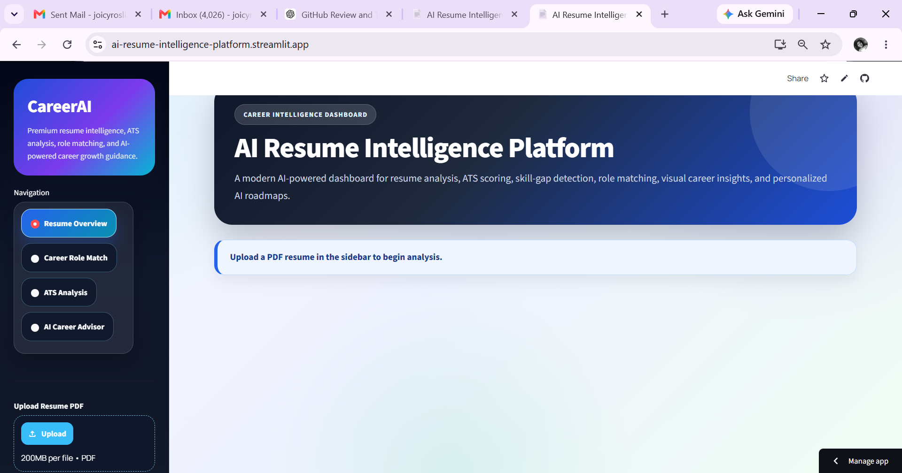
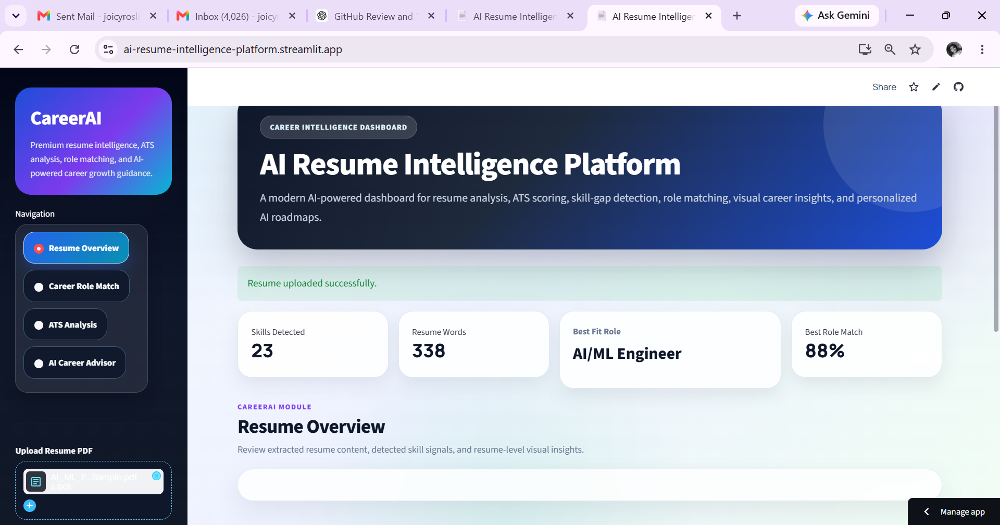
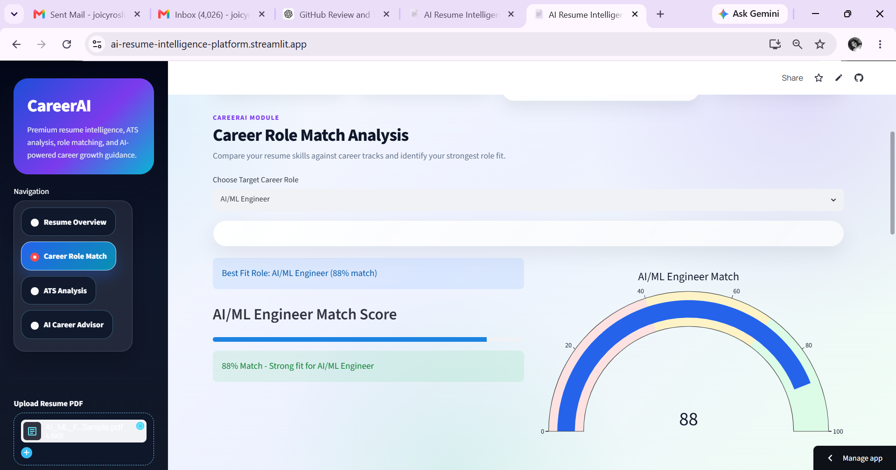
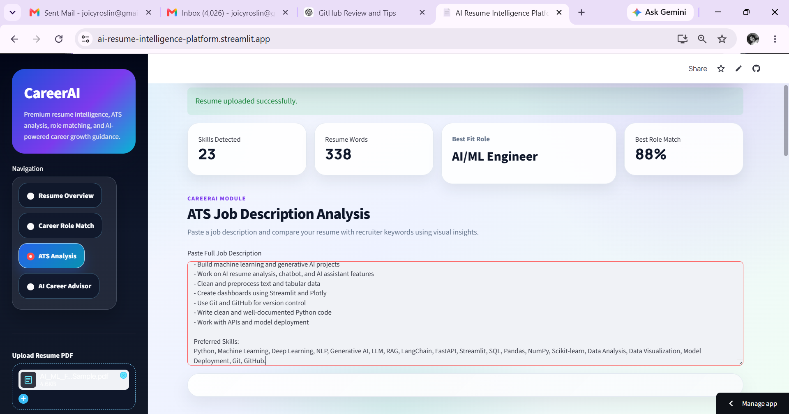
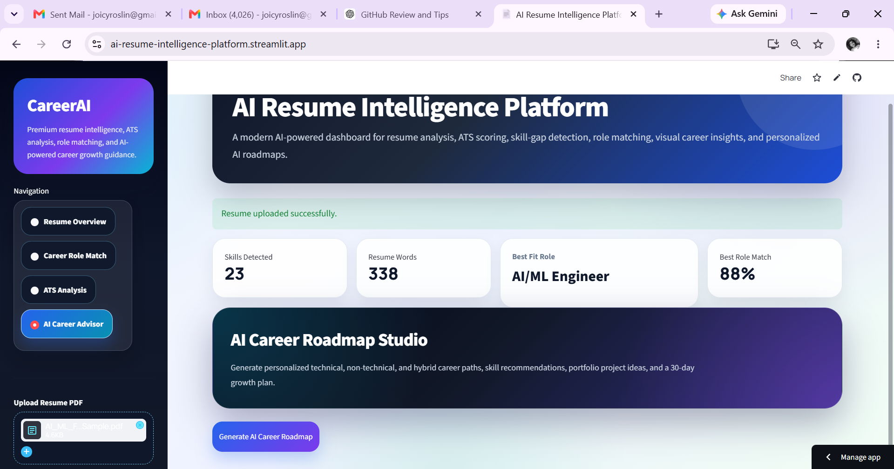

# AI Resume Intelligence Platform

A professional AI-powered resume intelligence dashboard that analyzes resume PDFs, extracts skills, calculates ATS score, matches career roles, detects skill gaps, visualizes insights using Plotly, and generates personalized career roadmaps using Gemini AI.

## Live Demo

[Click here to try the app](https://ai-resume-intelligence-platform.streamlit.app/)

## Project Overview

AI Resume Intelligence Platform helps students, freshers, and job seekers understand how well their resume matches different career paths and job descriptions.

The platform goes beyond a basic ATS checker by providing:

* Resume skill extraction
* ATS score analysis
* Career role matching
* Missing skill detection
* Visual analytics
* AI-powered personalized career recommendations

## Features

* Upload resume in PDF format
* Extract resume text automatically
* Clean and process resume text
* Detect technical and non-technical skills
* Compare resume with job descriptions
* Calculate ATS score
* Show matched and missing keywords
* Match resume with multiple career roles
* Recommend best-fit career path
* Display skill gap analysis
* Generate AI-powered career roadmap using Gemini API
* Show visual analytics using Plotly charts
* Professional Streamlit dashboard UI

## Career Role Matching

The platform supports technical, non-technical, and hybrid career roles such as:

* AI/ML Engineer
* Generative AI Engineer
* Data Scientist
* Data Analyst
* NLP Engineer
* Computer Vision Engineer
* MLOps Engineer
* Backend Developer
* Business Analyst
* Product Manager
* Technical Writer
* Prompt Engineer
* AI Product Analyst
* AI Solutions Consultant
* No-Code AI Builder

## Tech Stack

* Python
* Streamlit
* Gemini API
* Plotly
* Pandas
* PDFPlumber
* Python-dotenv
* Git & GitHub

## Screenshots

### Dashboard



### Resume Overview



(screenshots/resume-overview2.png.png)

### Career Role Match



(screenshots/career-role-match2.png.png)

(screenshots/career-role-match3.png.png)

### ATS Analysis



(screenshots/ats-analysis1.png.png)

(screenshots/ats-analysis2.png.png)

### AI Career Advisor



(screenshots/ai-career-advisor2.png.png)

## How to Run Locally

Clone the repository:

```bash
git clone https://github.com/joicyroslin-svg/AI-Resume-Intelligence-Platform.git
```

Move into the project folder:

```bash
cd AI-Resume-Intelligence-Platform
```

Create a virtual environment:

```bash
python -m venv .venv
```

Activate the virtual environment:

```bash
.venv\Scripts\activate
```

Install dependencies:

```bash
pip install -r requirements.txt
```

Run the Streamlit app:

```bash
python -m streamlit run app.py
```

## Environment Variables

Create a `.env` file in the project root:

```env
GEMINI_API_KEY=your_gemini_api_key_here
```

Do not upload your `.env` file to GitHub.

## Deployment

The project is deployed using Streamlit Community Cloud.

For deployment, add the Gemini API key in Streamlit Secrets:

```toml
GEMINI_API_KEY = "your_real_api_key_here"
```

## Project Structure

```text
AI-Resume-Intelligence-Platform/
│
├── app.py
├── requirements.txt
├── README.md
├── .gitignore
│
├── utils/
│   ├── pdf_reader.py
│   ├── text_cleaner.py
│   ├── skill_extractor.py
│   ├── ats_score.py
│   ├── resume_feedback.py
│   ├── career_recommender.py
│   ├── role_matcher.py
│   └── ai_career_advisor.py
│
├── screenshots/
│   ├── dashboard.png
│   ├── resume-overview.png
│   ├── career-role-match.png
│   ├── ats-analysis.png
│   └── ai-career-advisor.png
│
└── resumes/
```

## Future Improvements

* Add user login system
* Add resume score history
* Add downloadable PDF career report
* Add multiple resume comparison
* Add LinkedIn profile analyzer
* Add job role recommendation based on real job postings
* Add resume rewrite suggestions
* Add cover letter generator

## Resume Description

AI Resume Intelligence Platform — Built a Streamlit-based AI career dashboard that analyzes resume PDFs, extracts skills, calculates ATS score, matches career roles, visualizes insights using Plotly, and generates personalized career roadmaps using Gemini API.

## Author

Joicy Roslin

GitHub: [joicyroslin-svg](https://github.com/joicyroslin-svg)

Live App: [AI Resume Intelligence Platform](https://ai-resume-intelligence-platform.streamlit.app/)

